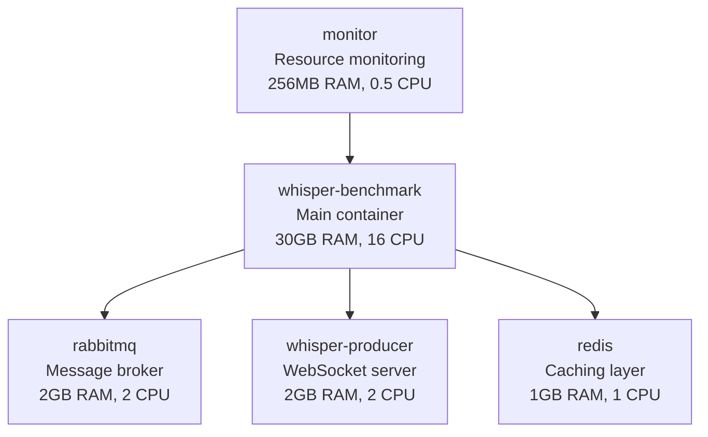

# Docker-Based Whisper Parallel Processing Benchmark

This guide provides a complete Docker-based solution for running high-resource benchmarks as specified in CLAUDE.md Task 4. The Docker environment provides:

- **16+ CPU cores allocation**
- **30GB+ RAM allocation**
- **Isolated benchmarking environment**
- **Consistent, reproducible results**
- **Easy resource monitoring**

## 📋 Prerequisites

### System Requirements

As per CLAUDE.md guidelines:
- **CPU**: 16+ cores recommended (minimum 8 cores)
- **RAM**: 32GB+ recommended (minimum 16GB)
- **Storage**: 10GB+ free space for Docker images and data
- **OS**: Linux, macOS, or Windows with WSL2

### Required Software

1. **Docker** (version 20.10+)
2. **Docker Compose** (version 2.0+)
3. **TIMIT Dataset** in `../timit_eval/` directory

### Installation Check

```bash
# Check Docker
docker --version
docker-compose --version

# Check system resources
echo "CPU Cores: $(nproc)"
echo "RAM: $(free -h | grep Mem | awk '{print $2}')"

# Verify TIMIT data
ls ../timit_eval/*.wav | wc -l
```

## 🚀 Quick Start

### 1. Build and Start Services

```bash
# Make script executable (Linux/macOS)
chmod +x docker-benchmark.sh

# Start all services
./docker-benchmark.sh start
```

### 2. Run Full Benchmark

```bash
# Run complete benchmark suite
./docker-benchmark.sh run full "1 2 4 8 16" 20
```

### 3. Check Results

Results are automatically saved to `./benchmark_results/`:
- Performance plots (PNG files)
- Raw data (CSV files)
- Console output with recommendations

## 🛠️ Detailed Usage

### Available Commands

```bash
./docker-benchmark.sh [command] [options]
```

| Command | Description | Example |
|---------|-------------|---------|
| `check` | Check system requirements | `./docker-benchmark.sh check` |
| `start` | Start Docker services only | `./docker-benchmark.sh start` |
| `run` | Run benchmark with options | `./docker-benchmark.sh run full "1 2 4 8" 15` |
| `interactive` | Open interactive shell | `./docker-benchmark.sh interactive` |
| `monitor` | Start resource monitoring | `./docker-benchmark.sh monitor` |
| `logs` | Show service logs | `./docker-benchmark.sh logs whisper-benchmark` |
| `stop` | Stop and cleanup | `./docker-benchmark.sh stop` |
| `clean` | Clean Docker resources | `./docker-benchmark.sh clean` |

### Benchmark Options

**Test Types:**
- `baseline` - Single process test (pool-size 1)
- `scaling` - Multi-process scaling tests
- `full` - Both baseline and scaling tests

**Pool Sizes:**
- Space-separated list: `"1 2 4 8 16 32"`
- Recommended: Start with `"1 2 4 8"` then expand

**Number of Files:**
- Default: 20 files per test
- Range: 10-50 files (more files = longer test, more accurate results)

### Example Usage Scenarios

**Quick baseline test:**
```bash
./docker-benchmark.sh run baseline "" 10
```

**Comprehensive scaling analysis:**
```bash
./docker-benchmark.sh run scaling "2 4 8 16 24 32" 30
```

**Custom configuration:**
```bash
./docker-benchmark.sh run full "1 4 8 16" 25
```

## 🏗️ Architecture Overview

### Docker Services



### Service Details

#### whisper-benchmark
- **Purpose**: Main benchmarking container
- **Resources**: 30GB RAM limit, 16 CPU cores
- **Volumes**: TIMIT data, results output
- **Function**: Runs benchmark tests and analysis

#### whisper-producer
- **Purpose**: WebSocket server for receiving requests
- **Port**: 8765
- **Function**: Handles client connections and queues tasks

#### rabbitmq
- **Purpose**: Message broker for task distribution
- **Ports**: 5672 (AMQP), 15672 (Management UI)
- **Function**: Queues transcription tasks between services

#### redis
- **Purpose**: Optional caching layer
- **Port**: 6379
- **Function**: Cache model weights and intermediate results

#### monitor
- **Purpose**: System resource monitoring
- **Port**: 9100
- **Function**: Exports system metrics for analysis

## 📊 Understanding Results

### Console Output

The benchmark provides real-time output showing:

```
RESULTS (Pool Size: 4):
  Files processed: 20/20
  Success rate: 100.0%
  Total time: 45.23s
  Avg time per file: 2.26s
  Processing rate: 3.2x real-time
  Peak CPU: 85.4%
  Avg CPU: 78.2%
  Peak Memory: 12.45GB
  Peak Load Avg: 8.7
```

### Key Metrics Explained

| Metric | Meaning | Good Values |
|--------|---------|-------------|
| **Processing Rate** | Audio time ÷ Processing time | >1.0x (faster than real-time) |
| **Success Rate** | % of files successfully processed | >95% |
| **Peak CPU** | Maximum CPU utilization | 70-90% (optimal) |
| **Peak Memory** | Maximum RAM usage | <80% of available |
| **Load Average** | System stress indicator | <number of CPU cores |

### Performance Analysis

The benchmark automatically identifies:

1. **Sweet Spot**: Optimal pool size for best performance
2. **Diminishing Returns**: Point where more processes don't help
3. **Resource Contention**: When system becomes overloaded
4. **Scaling Recommendations**: Vertical vs horizontal scaling advice

### Generated Files

#### Performance Plots (`whisper_benchmark_YYYYMMDD_HHMMSS.png`)

Four-panel visualization showing:
- Total processing time vs pool size
- Processing efficiency vs pool size
- CPU usage vs pool size
- Memory usage vs pool size

#### Raw Data (`whisper_benchmark_data_YYYYMMDD_HHMMSS.csv`)

Structured data with columns:
- `pool_size`: Number of parallel processes
- `total_time`: Wall-clock time for all files
- `processing_rate`: Efficiency metric
- `peak_cpu_percent`: Maximum CPU usage
- `peak_memory_gb`: Maximum memory usage
- `success_rate`: Completion percentage

## 🔧 Advanced Configuration

### Resource Limits

Edit `docker-compose.yml` to adjust resource allocation:

```yaml
whisper-benchmark:
  deploy:
    resources:
      limits:
        memory: 32G      # Adjust based on available RAM
        cpus: '20'       # Adjust based on available cores
      reservations:
        memory: 16G      # Minimum guaranteed RAM
        cpus: '10'       # Minimum guaranteed cores
```

### Environment Variables

Available configuration options:

```yaml
environment:
  - RABBITMQ_HOST=rabbitmq
  - RABBITMQ_PORT=5672
  - RABBITMQ_USER=whisper
  - RABBITMQ_PASS=whisper123
  - PYTHONPATH=/app
  - OMP_NUM_THREADS=1      # Control thread-level parallelism
  - MKL_NUM_THREADS=1      # Intel MKL threads
```

### Volume Mounts

```yaml
volumes:
  # TIMIT dataset (read-only)
  - ../timit_eval:/app/timit_eval:ro

  # Results output
  - ./benchmark_results:/app/benchmark_results

  # Source code (for development)
  - .:/app/src
```

## 🐛 Troubleshooting

### Common Issues

#### 1. Services Won't Start

**Problem**: Docker services fail to start
```bash
# Check Docker daemon
sudo systemctl status docker

# Check available resources
docker system df
free -h

# Clean up resources
docker system prune -f
```

#### 2. RabbitMQ Connection Failed

**Problem**: Cannot connect to RabbitMQ
```bash
# Check RabbitMQ logs
./docker-benchmark.sh logs rabbitmq

# Restart RabbitMQ service
docker-compose restart rabbitmq

# Verify connectivity
docker-compose exec whisper-benchmark nc -z rabbitmq 5672
```

#### 3. TIMIT Data Not Found

**Problem**: Audio files not accessible
```bash
# Check TIMIT directory
ls -la ../timit_eval/*.wav

# Fix permissions
chmod -R 755 ../timit_eval/

# Check volume mount
docker-compose exec whisper-benchmark ls -la /app/timit_eval/
```

#### 4. Out of Memory

**Problem**: Container runs out of memory
```bash
# Check memory usage
docker stats

# Reduce pool sizes or file count
./docker-benchmark.sh run scaling "1 2 4" 10

# Increase Docker memory limits
# Edit docker-compose.yml memory limits
```

#### 5. Benchmark Hangs

**Problem**: Benchmark stops responding
```bash
# Check container logs
./docker-benchmark.sh logs whisper-benchmark

# Monitor resources
./docker-benchmark.sh monitor

# Restart containers
./docker-benchmark.sh stop
./docker-benchmark.sh start
```

### Performance Optimization

#### 1. System Preparation

```bash
# Disable swap for consistent performance
sudo swapoff -a

# Set CPU governor to performance
echo performance | sudo tee /sys/devices/system/cpu/cpu*/cpufreq/scaling_governor

# Increase file descriptors
ulimit -n 65536
```

#### 2. Docker Optimization

```bash
# Allocate more resources to Docker
# Edit Docker Desktop settings or daemon.json:
{
  "default-runtime": "runc",
  "data-root": "/var/lib/docker",
  "storage-opts": ["overlay2.override_kernel_check=true"],
  "default-ulimits": {
    "nofile": {
      "Name": "nofile",
      "Hard": 64000,
      "Soft": 64000
    }
  }
}
```

#### 3. Benchmark Tuning

```bash
# Start with smaller tests
./docker-benchmark.sh run baseline "" 5

# Gradually increase load
./docker-benchmark.sh run scaling "2 4" 10
./docker-benchmark.sh run scaling "2 4 8" 15
./docker-benchmark.sh run full "1 2 4 8 16" 20
```

## 📈 Interpreting Results for Production

### Capacity Planning

Use benchmark results to determine:

1. **Optimal Configuration**
   - Best pool size per server
   - Expected throughput per machine
   - Resource utilization targets

2. **Scaling Strategy**
   - When to scale vertically (more CPU/RAM)
   - When to scale horizontally (more servers)
   - Load balancing requirements

3. **Infrastructure Requirements**
   - Server specifications
   - Network bandwidth needs
   - Storage requirements

### Example Analysis

```
Results Summary:
Pool Size 1:  1.2x real-time, 25% CPU, 8GB RAM
Pool Size 4:  3.2x real-time, 85% CPU, 12GB RAM  ← Optimal
Pool Size 8:  3.1x real-time, 95% CPU, 16GB RAM
Pool Size 16: 2.8x real-time, 98% CPU, 20GB RAM

Recommendation:
- Use pool size 4 for optimal efficiency
- Each server can handle ~3.2x real-time processing
- For 100 users submitting 1-minute files simultaneously:
  - Need ~31 servers (100 ÷ 3.2)
  - Each server: 16GB RAM, 8+ CPU cores
  - Consider horizontal scaling beyond pool size 4
```

## 🔍 Monitoring and Maintenance

### Real-time Monitoring

```bash
# Start resource monitoring
./docker-benchmark.sh monitor

# View live container stats
docker stats

# Check service health
docker-compose ps
```

### Log Analysis

```bash
# View all service logs
./docker-benchmark.sh logs

# View specific service logs
./docker-benchmark.sh logs whisper-benchmark
./docker-benchmark.sh logs rabbitmq
./docker-benchmark.sh logs whisper-producer
```

### Maintenance Tasks

```bash
# Regular cleanup
./docker-benchmark.sh clean

# Update containers
docker-compose pull
docker-compose up -d --build

# Backup results
cp -r benchmark_results/ backup_$(date +%Y%m%d)/
```

This Docker-based setup provides the high-resource environment specified in CLAUDE.md Task 4, enabling comprehensive parallel processing analysis with proper resource allocation and monitoring.